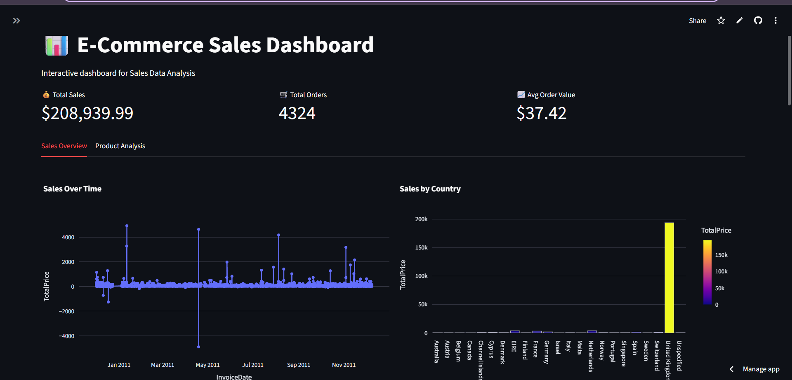
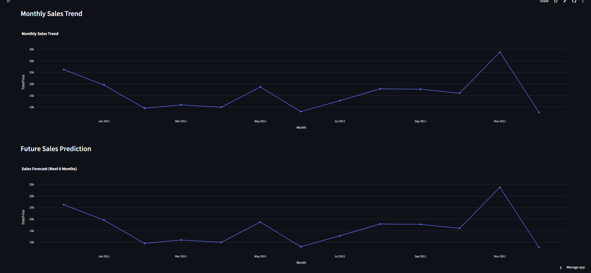
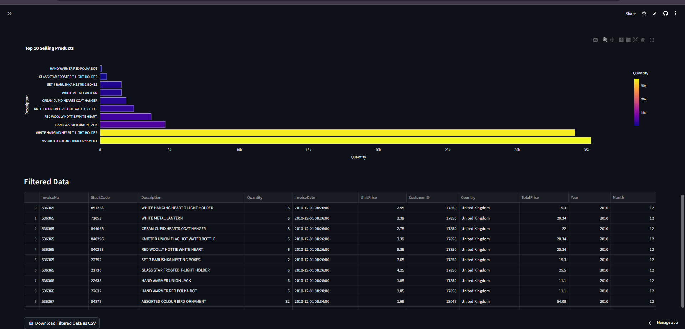

# 📊 E-commerce Sales Dashboard

## 📌 Project Overview
This project analyzes an E-commerce dataset to understand sales trends, customer behavior, and product performance.  
It also predicts future sales using Machine Learning and presents insights through an interactive dashboard.

## 🚀 Features
- Sales trend analysis
- Top selling products
- Country wise sales analysis
- Interactive filters (country, product, date)
- Sales prediction using Linear Regression
- Interactive dashboard

## 🛠️ Technologies Used
- Python
- Pandas
- Plotly
- Matplotlib
- Streamlit
- Scikit-learn

  ## 📂 Project Structure

Ecommerce-Sales-Dashboard/
│
├── dashboard.py                # Streamlit dashboard application
├── cleaned_sales_data.csv      # Processed dataset used for analysis
├── dataset.xlsx                # Original dataset
├── sales_analysis.ipynb        # Data analysis notebook
├── sales_prediction_model.pkl  # Trained machine learning model
├── requirements.txt            # Python libraries needed
└── README.md                   # Project documentation

## 📊 Dashboard
The dashboard allows users to:
- Filter sales by country
- Analyze product performance
- Track monthly sales trends

## ▶️ How to Run the Project

### 1️⃣ Clone the repository
git clone https://github.com/st-vaishnavi/Ecommerce-Sales-Dashboard.git

### 2️⃣ Install required libraries
pip install pandas streamlit plotly matplotlib scikit-learn

### 3️⃣ Run the dashboard
streamlit run dashboard.py

## 🌐 Live Dashboard
Try the interactive dashboard here:

https://ecommerce-sales-dashboard-msw4fhdkemnhp9uclbagxz.streamlit.app/

## 📊 Dashboard Overview

## 📈 Sales Analysis and prediction

## 🛍️ Product Insights

## 👩‍💻 Author
Vaishnavi Bagal  
Computer Science Engineering Student
